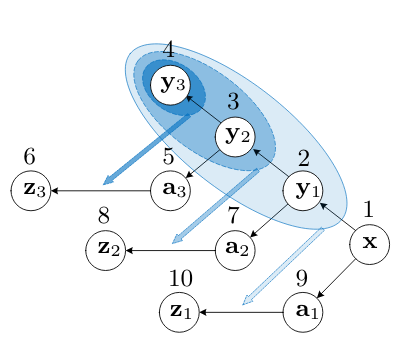
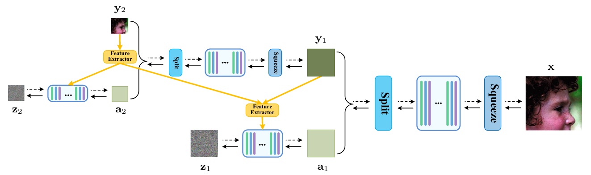
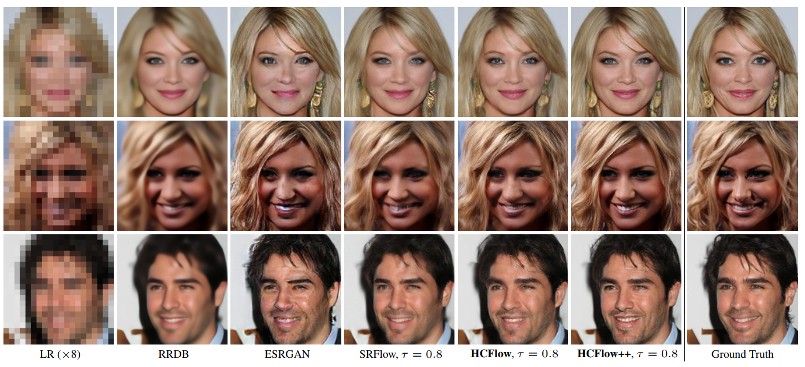

# Hierarchical Conditional Flow: A Unified Framework for Image Super-Resolution and Image Rescaling (HCFlow, ICCV2021)


[](https://arxiv.org/abs/2108.05301)
[](https://github.com/JingyunLiang/HCFlow)
[](https://github.com/JingyunLiang/HCFlow/releases)
[ <a href="https://colab.research.google.com/gist/JingyunLiang/cdb3fef89ebd174eaa43794accb6f59d/hcflow-demo-on-x8-face-image-sr.ipynb"></a>](https://colab.research.google.com/gist/JingyunLiang/cdb3fef89ebd174eaa43794accb6f59d/hcflow-demo-on-x8-face-image-sr.ipynb)
<a href="https://replicate.ai/jingyunliang/hcflow-sr"></a>

This repository is the official PyTorch implementation of Hierarchical Conditional Flow: A Unified Framework for Image Super-Resolution and Image Rescaling
([arxiv](https://arxiv.org/pdf/2108.05301.pdf), [supp](https://github.com/JingyunLiang/HCFlow/releases)).


:rocket:  :rocket:  :rocket: **News**: 
 - Sep. 07, 2021: We add an [online Colob demo <a href="https://colab.research.google.com/gist/JingyunLiang/cdb3fef89ebd174eaa43794accb6f59d/hcflow-demo-on-x8-face-image-sr.ipynb"></a>](https://colab.research.google.com/gist/JingyunLiang/cdb3fef89ebd174eaa43794accb6f59d/hcflow-demo-on-x8-face-image-sr.ipynb) for easy comparison of HCFlow and [SRFlow](https://github.com/andreas128/SRFlow).
 - Sep.06, 2021: See our recent work [SwinIR: Transformer-based image restoration](https://github.com/JingyunLiang/SwinIR) [](https://arxiv.org/abs/2108.10257)[](https://github.com/JingyunLiang/SwinIR)[](https://github.com/JingyunLiang/SwinIR/releases)[ <a href="https://colab.research.google.com/gist/JingyunLiang/a5e3e54bc9ef8d7bf594f6fee8208533/swinir-demo-on-real-world-image-sr.ipynb"></a>](https://colab.research.google.com/gist/JingyunLiang/a5e3e54bc9ef8d7bf594f6fee8208533/swinir-demo-on-real-world-image-sr.ipynb)
 - Aug. 17, 2021: See our recent work for [blind SR: Mutual Affine Network for Spatially Variant Kernel Estimation in Blind Image Super-Resolution (MANet), ICCV2021](https://github.com/JingyunLiang/MANet) [](https://arxiv.org/abs/2108.05302)[](https://github.com/JingyunLiang/MANet)
[](https://github.com/JingyunLiang/MANet/releases)[ <a href="https://colab.research.google.com/gist/JingyunLiang/4ed2524d6e08343710ee408a4d997e1c/manet-demo-on-spatially-variant-kernel-estimation.ipynb"></a>](https://colab.research.google.com/gist/JingyunLiang/4ed2524d6e08343710ee408a4d997e1c/manet-demo-on-spatially-variant-kernel-estimation.ipynb)
 - Aug. 17, 2021: See our recent work for [real-world image SR: Designing a Practical Degradation Model for Deep Blind Image Super-Resolution (BSRGAN), ICCV2021](https://github.com/cszn/BSRGAN) [](https://arxiv.org/abs/2103.14006)
[](https://github.com/cszn/BSRGAN)
 - Aug. 17, 2021: See our previous [flow-based kernel estimation: Flow-based Kernel Prior with Application to Blind Super-Resolution (FKP), CVPR2021](https://github.com/JingyunLiang/FKP) [](https://arxiv.org/abs/2103.15977)
[](https://github.com/JingyunLiang/FKP)
 ---

> Normalizing flows have recently demonstrated promising results for low-level vision tasks. For image super-resolution (SR), it learns to predict diverse photo-realistic high-resolution (HR) images from the low-resolution (LR) image rather than learning a deterministic mapping. For image rescaling, it achieves high accuracy by jointly modelling the downscaling and upscaling processes. While existing approaches employ specialized techniques for these two tasks, we set out to unify them in a single formulation. In this paper, we propose the hierarchical conditional flow (HCFlow) as a unified framework for image SR and image rescaling. More specifically, HCFlow learns a bijective mapping between HR and LR image pairs by modelling the distribution of the LR image and the rest high-frequency component simultaneously. In particular, the high-frequency component is conditional on the LR image in a hierarchical manner. To further enhance the performance, other losses such as perceptual loss and GAN loss are combined with the commonly used negative log-likelihood loss in training. Extensive experiments on general image SR, face image SR and image rescaling have demonstrated that the proposed HCFlow achieves state-of-the-art performance in terms of both quantitative metrics and visual quality.
><p align="center">
  > &nbsp;&nbsp;&nbsp;&nbsp;&nbsp;&nbsp;&nbsp;&nbsp;&nbsp;
</p>

## Requirements
- Python 3.7, PyTorch == 1.7.1
- Requirements: opencv-python, lpips, natsort, etc.
- Platforms: Ubuntu 16.04, cuda-11.0


```bash
cd HCFlow-master
pip install -r requirements.txt 
```

## Quick Run (takes 1 Minute)
To run the code with one command (without preparing data), run following command. Or you can go to our [online Colob demo <a href="https://colab.research.google.com/gist/JingyunLiang/cdb3fef89ebd174eaa43794accb6f59d/hcflow-demo-on-x8-face-image-sr.ipynb"></a>](https://colab.research.google.com/gist/JingyunLiang/cdb3fef89ebd174eaa43794accb6f59d/hcflow-demo-on-x8-face-image-sr.ipynb) to have a try.
```bash
cd codes
# face image SR
python test_HCFlow.py --opt options/test/test_SR_CelebA_8X_HCFlow.yml

# general image SR
python test_HCFlow.py --opt options/test/test_SR_DF2K_4X_HCFlow.yml

# image rescaling
python test_HCFlow.py --opt options/test/test_Rescaling_DF2K_4X_HCFlow.yml
```
---

## Data Preparation
The framework of this project is based on [MMSR](https://github.com/open-mmlab/mmediting) and [SRFlow](https://github.com/andreas128/SRFlow). To prepare data, put training and testing sets in `./datasets` as `./datasets/DIV2K/HR/0801.png`. Commonly used SR datasets can be downloaded [here](https://github.com/xinntao/BasicSR/blob/master/docs/DatasetPreparation.md#common-image-sr-datasets). 
There are two ways for accerleration in data loading: First, one can use `./scripts/png2npy.py` to generate `.npy` files and use `data/GTLQnpy_dataset.py`. Second, one can use `.pklv4` dataset (*recommended*) and use `data/LRHR_PKL_dataset.py`. Please refer to [SRFlow](https://github.com/andreas128/SRFlow#dataset-how-to-train-on-your-own-data) for more details. Prepared datasets can be downloaded [here](http://data.vision.ee.ethz.ch/alugmayr/SRFlow/datasets.zip).

## Training

To train HCFlow for general image SR/ face image SR/ image rescaling, run this command:

```bash
cd codes

# face image SR
python train_HCFlow.py --opt options/train/train_SR_CelebA_8X_HCFlow.yml

# general image SR
python train_HCFlow.py --opt options/train/train_SR_DF2K_4X_HCFlow.yml

# image rescaling
python train_HCFlow.py --opt options/train/train_Rescaling_DF2K_4X_HCFlow.yml
```
All trained models can be downloaded from [here](https://github.com/JingyunLiang/HCFlow/releases).


## Testing

Please follow the **Quick Run** section. Just modify the dataset path in `test_HCFlow_*.yml`.

## Results
We achieved state-of-the-art performance on general image SR, face image SR and image rescaling. 
> 
> 
For more results, please refer to the [paper](https://arxiv.org/abs/2108.05301) and [supp](https://github.com/JingyunLiang/HCFlow/releases) for details. 

## Citation
    @inproceedings{liang21hierarchical,
      title={Hierarchical Conditional Flow: A Unified Framework for Image Super-Resolution and Image Rescaling},
      author={Liang, Jingyun and Lugmayr, Andreas and Zhang, Kai and Danelljan, Martin and Van Gool, Luc and Timofte, Radu},
      booktitle={IEEE International Conference on Computer Vision},
      year={2021}
    }


## License & Acknowledgement

This project is released under the Apache 2.0 license. The codes are based on [MMSR](https://github.com/open-mmlab/mmediting), [SRFlow](https://github.com/andreas128/SRFlow), [IRN](https://github.com/pkuxmq/Invertible-Image-Rescaling) and [Glow-pytorch](https://github.com/chaiyujin/glow-pytorch). Please also follow their licenses. Thanks for their great works.

